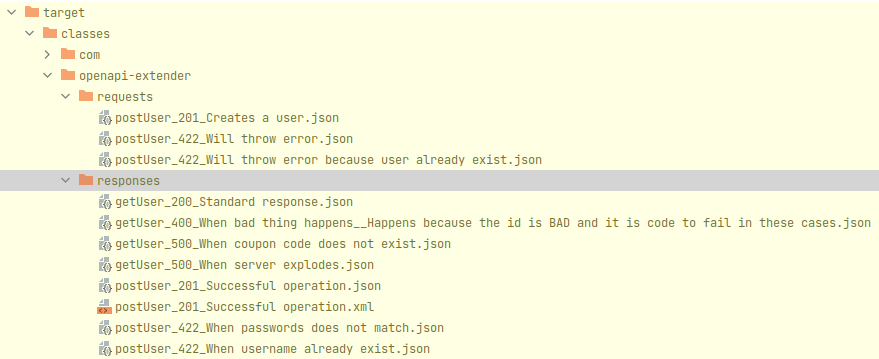
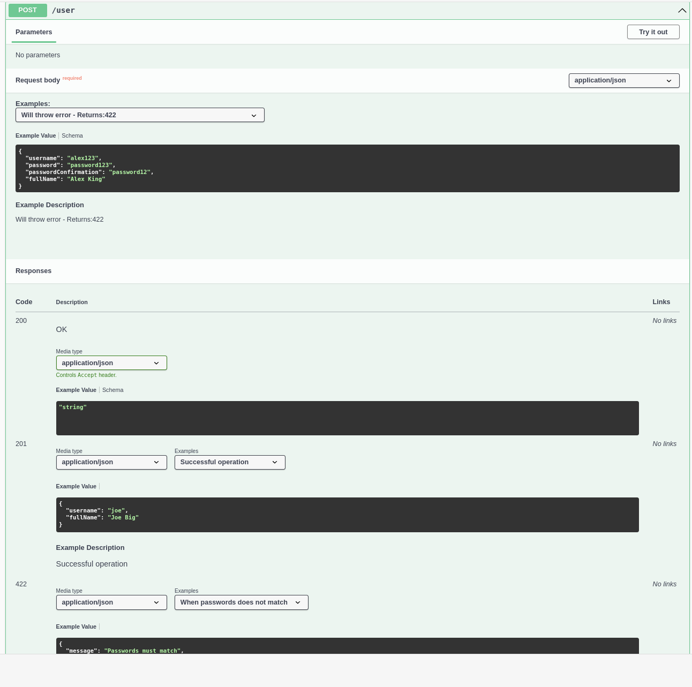

# OpenAPI Extender


## Motivation

Writing proper OpenAPI documentations are time consuming, if you really want to make sure your clients are understanding the API itself, massive amount of summaries and examples should be provided, not mandatory, but if you are on the other side of
the API, you might be also happier if an API is verbose as possible.

## Goals

The goal of this project to make sure that your OpenAPI documentation is having enough extra details, that you might not want to write by yourself in the documentation, but you would like to use other, earlier written resources to fulfil these
requirements/needs/gaps in your documentation.

Developers are writing unit and integration tests on their projects, and a good test could be providing the different input and output values for a component. API developers are writing tons of integration tests for the different use cases and it
happens sometimes that they are not giving out these tests, because of course security and privacy rules, but some output of these tests could be used to extend the already existing API.

[Spring's REST Docs](https://github.com/spring-projects/spring-restdocs) does something similar, but it is not heavily involved in the OpenAPI initiative.

## Implementation

The project is split up into multiple modules to make sure the end users are not depending on some unnecessary dependencies:

- [openapi-extender](openapi-extender) - Core part, that does the "heavy-lifting" that works with the OpenAPI model classes
- [openapi-extender-test-tool](openapi-extender-test-tool) - Testing tool module that is working with the contents of the test results
- [openapi-extender-spring-test](openapi-extender-spring-test) - Spring Test extension
- [openapi-extender-springdoc](openapi-extender-springdoc) - SpringDoc extension

## Usage

<details>

    <summary>Spring Boot based example</summary>

```java

@SpringBootApplication
class SpringBootOpenmapiWithTestApplication {

    public static void main(String[] args) {
        SpringApplication.run(SpringBootOpenmapiWithTestApplication.class, args);
    }

    @Bean
    public ApiResponseAndExampleCustomizer customizer() {
        return new ApiResponseAndExampleCustomizer();
    }

}


@RestController
class UserController {

    @GetMapping(path = "/user", produces = {MediaType.APPLICATION_JSON_VALUE, MediaType.APPLICATION_XML_VALUE})
    public ResponseEntity getUser(@RequestParam(name = "id", required = false) String id) {
        if ("BAD".equals(id)) return ResponseEntity.badRequest().body(new ErrorResponse("Bad " + id, "Cause it went bad"));
        else if ("BAD2".equals(id)) return ResponseEntity.internalServerError().body(new ErrorResponse("Internal Server Error " + id, "Bad because internal"));
        else return ResponseEntity.ok(new UserResponse("joe", "Joe Big"));
    }

    @PostMapping(path = "/user", produces = {MediaType.APPLICATION_JSON_VALUE, MediaType.APPLICATION_XML_VALUE})
    public ResponseEntity postUser(@RequestBody UserRequest userRequest) {
        if (!userRequest.getPassword().equals(userRequest.getPasswordConfirmation())) {
            return ResponseEntity.unprocessableEntity().body(new ErrorResponse("Passwords must match", "Cause it went bad"));
        }
        if (userRequest.getUsername().equals("bob")) {
            return ResponseEntity.unprocessableEntity().body(new ErrorResponse("Username already exists", "Cause it went bad"));
        }
        return ResponseEntity.status(HttpStatus.CREATED).body(new UserResponse("joe", "Joe Big"));
    }

    @Data
    @NoArgsConstructor
    @AllArgsConstructor
    static class UserRequest {

        private String username;
        private String password;
        private String passwordConfirmation;
        private String fullName;
    }

    @Data
    @NoArgsConstructor
    @AllArgsConstructor
    static class ErrorResponse {

        private String message;
        private String cause;
    }

    @Data
    @NoArgsConstructor
    @AllArgsConstructor
    static class UserResponse {

        private String username;
        private String fullName;

    }

}

@SpringBootTest
@AutoConfigureMockMvc
class UserControllerTest {

    @Autowired
    private MockMvc mockMvc;

    @Test
    void getUser_isOk() throws Exception {
        mockMvc.perform(get("/user"))
            .andExpect(status().isOk())
            .andDo(result -> new ApiResponseDocumentReporter("getUser", "Standard response").handle(result));
    }

    @Test
    void getUser_isBadRequest() throws Exception {
        mockMvc.perform(get("/user?id=BAD"))
            .andExpect(status().isBadRequest())
            .andDo(result -> new ApiResponseDocumentReporter("getUser", "When shit happens").handle(result));
    }

    @Test
    void getUser_isInternalError_1() throws Exception {
        mockMvc.perform(get("/user?id=BAD2"))
            .andExpect(status().isInternalServerError())
            .andDo(result -> new ApiResponseDocumentReporter("getUser", "When coupon code does not exist").handle(result));
    }

    @Test
    void getUser_isInternalError_2() throws Exception {
        mockMvc.perform(get("/user?id=BAD2"))
            .andExpect(status().isInternalServerError())
            .andDo(result -> new ApiResponseDocumentReporter("getUser", "When shit explodes").handle(result));
    }

    @Test
    void postUser_WhenPasswordDoesNotMatch() throws Exception {
        UserController.UserRequest userRequest = new UserController.UserRequest("alex123", "password123", "password12", "Alex King");
        mockMvc.perform(post("/user").contentType(MediaType.APPLICATION_JSON).content(asJsonString(userRequest)))
            .andExpect(status().isUnprocessableEntity())
            .andDo(result -> new ApiResponseDocumentReporter("postUser", "When passwords does not match").handle(result))
            .andDo(result -> new RequestBodyDocumentReporter("postUser", "Will throw error").handle(result));
    }

    @Test
    void postUser_WhenUsernameAlreadyExist() throws Exception {
        UserController.UserRequest userRequest = new UserController.UserRequest("bob", "password123", "password123", "Bob Sug");
        mockMvc.perform(post("/user").contentType(MediaType.APPLICATION_JSON).accept(MediaType.APPLICATION_JSON).content(asJsonString(userRequest)))
            .andExpect(status().isUnprocessableEntity())
            .andDo(result -> new ApiResponseDocumentReporter("postUser", "When username already exist").handle(result))
            .andDo(result -> new RequestBodyDocumentReporter("postUser", "Will throw error because user already exist").handle(result));
    }

    @Test
    void postUser_WhenEverythingIsOk() throws Exception {
        UserController.UserRequest userRequest = new UserController.UserRequest("new-bob", "password123", "password123", "Bob Sug");
        mockMvc.perform(post("/user").contentType(MediaType.APPLICATION_JSON).accept(MediaType.APPLICATION_JSON).content(asJsonString(userRequest)))
            .andExpect(status().isCreated())
            .andDo(result -> new ApiResponseDocumentReporter("postUser", "Successful operation").handle(result))
            .andDo(result -> new RequestBodyDocumentReporter("postUser", "Creates a user").handle(result));
    }

    @Test
    void postUser_WhenEverythingIsOkXml() throws Exception {
        UserController.UserRequest userRequest = new UserController.UserRequest("new-bob", "password123", "password123", "Bob Sug");
        mockMvc.perform(post("/user").contentType(MediaType.APPLICATION_JSON).accept(MediaType.APPLICATION_XML).content(asJsonString(userRequest)))
            .andExpect(status().isCreated())
            .andDo(result -> new ApiResponseDocumentReporter("postUser", "Successful operation").handle(result))
            .andDo(result -> new RequestBodyDocumentReporter("postUser", "Creates a user").handle(result));
    }

    static String asJsonString(final Object obj) {
        try {
            return new ObjectMapper().writeValueAsString(obj);
        } catch (Exception e) {
            throw new RuntimeException(e);
        }
    }

}

```

After running: `./mvnw package` the following generated classes will pop up:


**requests/postUser/201_Creates a user.json**: 
```json
{
  "username": "new-bob",
  "password": "password123",
  "passwordConfirmation": "password123",
  "fullName": "Bob Sug"
}
```

**responses/postUser/201_Successful operation.json**:
```json
{
  "username" : "joe",
  "fullName" : "Joe Big"
}
```

**responses/postUser/422_When passwords does not match.json**:
```json
{
  "message" : "Passwords must match",
  "cause" : "Cause it went bad"
}
```

</details>

<details>
    <summary>Swagger UI Preview</summary>



</details>

<details>
  <summary>Generated OpenAPI documentation</summary>

```yaml
openapi: 3.0.1
info:
  title: OpenAPI definition
  version: v0
servers:
- url: http://localhost:8080
  description: Generated server url
paths:
  /user:
    get:
      tags:
      - user-controller
      operationId: getUser
      parameters:
      - name: id
        in: query
        required: false
        schema:
          type: string
      responses:
        "200":
          description: OK
          content:
            application/json:
              schema:
                type: string
              examples:
                Standard response:
                  description: Standard response
                  value: |-
                    {
                      "username" : "joe",
                      "fullName" : "Joe Big"
                    }
            application/xml:
              schema:
                type: string
              examples:
                Standard response:
                  description: Standard response
                  value: |-
                    {
                      "username" : "joe",
                      "fullName" : "Joe Big"
                    }
        "500":
          content:
            application/json:
              examples:
                When coupon code does not exist:
                  description: When coupon code does not exist
                  value: |-
                    {
                      "message" : "Internal Server Error BAD2",
                      "cause" : "Bad because internal"
                    }
                When server explodes:
                  description: When server explodes
                  value: |-
                    {
                      "message" : "Internal Server Error BAD2",
                      "cause" : "Bad because internal"
                    }
        "400":
          content:
            application/json:
              examples:
                When bad thing happens:
                  description: When bad thing happens
                  value: |-
                    {
                      "message" : "Bad BAD",
                      "cause" : "Cause it went bad"
                    }
    post:
      tags:
      - user-controller
      operationId: postUser
      requestBody:
        content:
          application/json:
            schema:
              $ref: '#/components/schemas/UserRequest'
            examples:
              Will throw error - Returns:422:
                description: Will throw error - Returns:422
                value: |-
                  {
                    "username" : "alex123",
                    "password" : "password123",
                    "passwordConfirmation" : "password12",
                    "fullName" : "Alex King"
                  }
              Will throw error because user already exist - Returns:422:
                description: Will throw error because user already exist - Returns:422
                value: |-
                  {
                    "username" : "bob",
                    "password" : "password123",
                    "passwordConfirmation" : "password123",
                    "fullName" : "Bob Sug"
                  }
              Creates a user - Returns:201:
                description: Creates a user - Returns:201
                value: |-
                  {
                    "username" : "new-bob",
                    "password" : "password123",
                    "passwordConfirmation" : "password123",
                    "fullName" : "Bob Sug"
                  }
        required: true
      responses:
        "200":
          description: OK
          content:
            application/json:
              schema:
                type: string
            application/xml:
              schema:
                type: string
        "201":
          content:
            application/json:
              examples:
                Successful operation:
                  description: Successful operation
                  value: |-
                    {
                      "username" : "joe",
                      "fullName" : "Joe Big"
                    }
            application/xml:
              examples:
                Successful operation:
                  description: Successful operation
                  value: |
                    <LinkedHashMap>
                      <username>joe</username>
                      <fullName>Joe Big</fullName>
                    </LinkedHashMap>
        "422":
          content:
            application/json:
              examples:
                When passwords does not match:
                  description: When passwords does not match
                  value: |-
                    {
                      "message" : "Passwords must match",
                      "cause" : "Cause it went bad"
                    }
                When username already exist:
                  description: When username already exist
                  value: |-
                    {
                      "message" : "Username already exists",
                      "cause" : "Cause it went bad"
                    }
components:
  schemas:
    UserRequest:
      type: object
      properties:
        username:
          type: string
        password:
          type: string
        passwordConfirmation:
          type: string
        fullName:
          type: string
```
</details>
