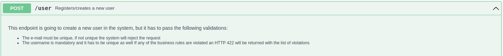
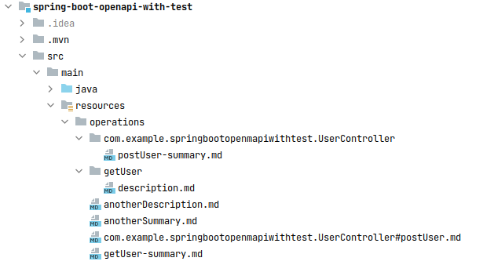

ifndef::env-github[]
:icons: font
endif::[]
ifdef::env-github[]
:caution-caption: :fire:
:important-caption: :exclamation:
:note-caption: :paperclip:
:tip-caption: :bulb:
:warning-caption: :warning:
endif::[]
:toc:
:toc-placement!:
:toclevels: 4
[#extra-summarie]
==== Summaries and descriptions

Developers tend to provide summaries and descriptions for their API endpoints/operations. Sometimes these descriptor attributes are brief, really tells you nothing about the whole operation, and you have to dig deeper, you may ask your co-worker about it, or if it is a public API you may read more about it somewhere.

These descriptors are not always fun to write, if you are not writing them directly into an OpenAPI YAML or JSON file, you may end up in the production code which on different Java versions can be ugly, just to give you some examples.

.With Java 8
[source,java]
----
@RestController
interface UserController {

    @Operation(summary = "Registers/creates a new user",
        description = "This endpoint is going to create a new user in the system, but it has to pass the following validations:\n" +
            "- The e-mail must be unique, if not unique the system will reject the request\n" +
            "- The username is mandatory and it has to be unique as well\n" +
            "If any of the business rules are violated an HTTP 422 will be returned with the list of violations")
    @PostMapping(path = "/user", produces = {MediaType.APPLICATION_JSON_VALUE, MediaType.APPLICATION_XML_VALUE})
    ResponseEntity postUser(@RequestBody UserRequest userRequest);
}
----

.With Java 15+ Text Blocks
[source,java]
----
@RestController
interface UserController {

    @Operation(summary = "Registers/creates a new user",
        description = """
            This endpoint is going to create a new user in the system, but it has to pass the following validations:
            - The e-mail must be unique, if not unique the system will reject the request
            - The username is mandatory and it has to be unique as well
            If any of the business rules are violated an HTTP 422 will be returned with the list of violations
            """)
    @PostMapping(path = "/user", produces = {MediaType.APPLICATION_JSON_VALUE, MediaType.APPLICATION_XML_VALUE})
    ResponseEntity postUser(@RequestBody UserRequest userRequest);
}
----

.With property file and property resolution (messages.properties) - It supports localization - *NOT* application.properties
[source,properties]
----
postUser.summary=Registers/creates a new user
postUser.description=This endpoint is going to create a new user in the system, but it has to pass the following validations: \n \
    - The e-mail must be unique, if not unique the system will reject the request \n \
    - The username is mandatory and it has to be unique as well \n \n \
    If any of the business rules are violated an HTTP 422 will be returned with the list of violations
----
[source,java]
----
@RestController
interface UserController {

    @Operation(summary = "postUser.summary",description = "postUser.description")
    @PostMapping(path = "/user", produces = {MediaType.APPLICATION_JSON_VALUE, MediaType.APPLICATION_XML_VALUE})
    ResponseEntity postUser(@RequestBody UserRequest userRequest);
}
----

.With application.properties or application.yml file - It *DOES NOT* support localization - Right now `.yml`
[source,properties]
----
postUser:
  summary: Summary from application.yml
  description: |
    This endpoint is going to create a new user in the system, but it has to pass the following validations:
     - The e-mail must be unique, if not unique the system will reject the request
     - The username is mandatory and it has to be unique as well
    If any of the business rules are violated an HTTP 422 will be returned with the list of violations
----
[source,java]
----
@RestController
interface UserController {

    @Operation(summary = "${postUser.summary}",description = "${postUser.description}")
    @PostMapping(path = "/user", produces = {MediaType.APPLICATION_JSON_VALUE, MediaType.APPLICATION_XML_VALUE})
    ResponseEntity postUser(@RequestBody UserRequest userRequest);
}
----

.Result
All 4 does the job, but as OpenAPI is supporting CommonMark markdown formatting, we, in the Java source code and in the property/yaml files, lose the ability to properly format and preview our written documentation.

=== Our solution

If we keep populating any of the above-mentioned files the production code will become huge and ugly, we would like to change this way and we would like to propose another idea.

As most code editors support Markdown rendering, we offer you the solution to write all the summaries and descriptions in a Markdown file under the `src/main/resources` folder, (in a specified subdirectory for example `operations`) and our tool will inject those Markdown files, during runtime, to your OpenAPI definition file.

You have many options to have these files injected, here is the list of options how to configure those:

1. Instantiate the `org.rodnansol.openapi.extender.springdoc.description.OperationDescriptionCustomizer` as a new bean (`@Bean`) and set the path where the markdown files can be found, you can override the extesnion as well if it is not just `.md`.

[source,java]
----
@SpringBootApplication
public class App {

    public static void main(String[] args) {
        SpringApplication.run(App.class, args);
    }

    @Bean
    public OperationDescriptionCustomizer operationDescriptionCustomizer() {
        OperationDescriptionConfiguration configuration = OperationDescriptionConfiguration.builder()
            .resourcesBasePath("operations")  // <1>
            .extension(".md") // <2>
            .build();
        OperationDescriptionCustomizer operations = new OperationDescriptionCustomizer(configuration, new OperationDescriptionLoaderService());
        operations.setInBackground(true); // <3>
        return operations;
    }

}
----
<1> If your files reside in the `src/main/resources/operations` directory use the following configuration.
<2> By default, the `.md` is the extension, but it can be overwritten.
<3> If you have a lot of operations than it would be good to run those in the background and the OpenAPI documentation will have all the necessary summaries and descriptions after the process is done, with that the documentation is not blocked.

==== How to name the files?

The tool has a few resolvers to find the files.

- Based on the operation's identifier (`@Operation(operationId="")`)

TIP: If it is not specified the operation's identifier will be the method's name by default.

- Based on the methods fully qualified name.
- Based on a custom OpenAPI Extension key and properties.

===== Operation identifier resolver

This resolver will search resources in the following paths with a ClassLoader.

- /<resourceBasePath>/<operationId><postFix><extension>
- /<resourceBasePath>/<operationId>/<descriptorType><extension>

For example:

- /operations/getUser-summary.md
- /operations/postUser/description.md

===== Method name resolver

This resolver will search resources in the following paths with a ClassLoader.

- `/<resourceBasePath>/<fullyQualifiedMethodName><postFix><extension>`
- `/<resourceBasePath>/<className>/<method>-<descriptorType><extension>`

The different path can be defined within the constructor. For example:

- `/operations/org.rodnansol.user.UserController#getUser-summary.md`
- `/operations/org.rodnansol.user.UserController/postUser/description.md`

.Example project setup for *Operation identifier resolver* and *Method name resolver*

===== Custom OpenAPI Extension key

This resolver will search resources in the following paths with a ClassLoader.

The resources must be configured on the method level:

[source,java]
----
@RestController
interface UserController {

@Operation(extensions = {
        @Extension(name = OpenApiExtenderExtensionConstants.EXTENSION_KEY, // <1>
            properties = {
                @ExtensionProperty(name = OpenApiExtenderExtensionConstants.DESCRIPTION_KEY, value = "operations/anotherDescription.md"), // <2>
                @ExtensionProperty(name = OpenApiExtenderExtensionConstants.SUMMARY_KEY, value = "operations/anotherSummary.md")} // <3>
        )
    })
    @PutMapping(path = "/user/{id}", produces = {MediaType.APPLICATION_JSON_VALUE})
    ResponseEntity putUser(@RequestParam(name = "id", required = false) String id);

}
----
<1> Custom extension key (`EXTENSION_KEY = "x-extender";`)
<2> Description resource path.
<3> Summary resource path.

WARNING: I18N is not yet supported, only one locale can be used.
